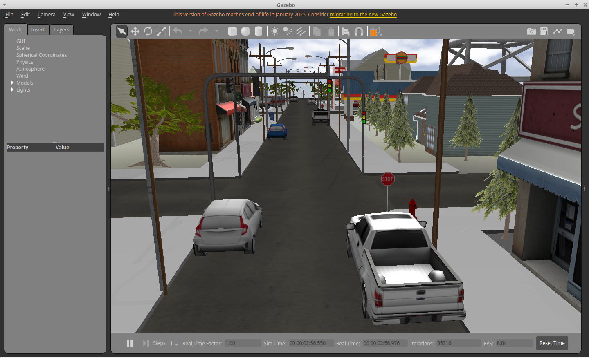

# Small City Simulation Environment для Gazebo

## Описание

**small_city_sim** — детализированная модель городской среды для симулятора Gazebo (классическая версия 11) и ROS Noetic. Включает:

- Прямоугольную сетку дорог (5 продольных, 3 поперечные) с тротуарами
- Более 50 зданий (жилые дома, офисы, магазины, АЗС)
- Около 60 деревьев (дубы, сосны)
- Статически припаркованные автомобили (легковые, пикапы, скорая помощь)
- Дорожную инфраструктуру: светофоры, знаки STOP, фонарные столбы, телефонные столбы, гидранты
- Мосты, фонтан, пирс, водную поверхность
- **Динамическую модель автомобиля** `hatchback_dynamic` с дифференциальным приводом, управляемую через ROS

## Скриншоты

*Рис. 1 – Общий вид среды `small_city.world`*

*Рис. 2 – Перекрёсток и припаркованные машины*

*Рис. 3 – Управляемый автомобиль*

## Требования

- Ubuntu 20.04 (рекомендуется) или 22.04
- Gazebo 11.x (Gazebo Classic)
- ROS Noetic (полная установка `ros-noetic-desktop-full`)
- Дополнительные пакеты:
  sudo apt install ros-noetic-gazebo-ros-pkgs ros-noetic-gazebo-ros-control ros-noetic-gazebo-plugins

## Установка

1. Клонируйте репозиторий:
   git clone https://github.com/username/small_city_sim.git
   cd small_city_sim

2. Установите стандартные модели Gazebo:
   sudo apt install gazebo11-common
   # или вручную: git clone https://github.com/osrf/gazebo_models ~/.gazebo/models

3. (Опционально) Добавьте путь к собственным моделям:
   echo "export GAZEBO_MODEL_PATH=\$GAZEBO_MODEL_PATH:\$(pwd)/models" >> ~/.bashrc
   source ~/.bashrc

4. Установите динамическую модель `hatchback_dynamic`:
   cp -r models/hatchback_dynamic ~/.gazebo/models/

## Запуск

### Базовый запуск (только Gazebo)
gazebo worlds/small_city.world

### Запуск с интеграцией ROS (рекомендуется)

**Терминал 1:**
roscore

**Терминал 2:**
roslaunch gazebo_ros empty_world.launch world_name:=$(pwd)/worlds/small_city.world

**Терминал 3 (спавн динамического автомобиля):**
rosrun gazebo_ros spawn_model -sdf -model hatchback_dynamic \
  -file ~/.gazebo/models/hatchback_dynamic/model.sdf \
  -x 0 -y 0 -z 0.2

**Альтернативно, используйте готовый launch-файл:**
roslaunch small_city_sim city_with_car.launch

## Управление автомобилем

После спавна модели появится топик `/hatchback_dynamic/cmd_vel`.

### Ручное управление из терминала:
# Движение вперёд
rostopic pub /hatchback_dynamic/cmd_vel geometry_msgs/Twist "linear: {x: 0.5}"

# Поворот
rostopic pub /hatchback_dynamic/cmd_vel geometry_msgs/Twist "angular: {z: 0.5}"

# Остановка
rostopic pub /hatchback_dynamic/cmd_vel geometry_msgs/Twist "linear: {x: 0.0}"

Скрипт для движения по кругу (`scripts/simple_driver.py`):
python3 scripts/simple_driver.py

## Известные проблемы

- **Ошибка `Address already in use`** – убейте процессы: `sudo pkill -9 gzserver && sudo pkill -9 gzclient`
- **Сервис `/gazebo/spawn_sdf_model` не появляется** – запускайте Gazebo через `roslaunch`, а не напрямую `gazebo`
- **Автомобиль проваливается** – поднимите spawn выше (`-z 0.2`) или проверьте коллизию дорог
- **Тротуары без коллизий** – осознанное упрощение для производительности

## Лицензия

MIT. См. файл `LICENSE`.

## Контакты

Автор: [Марат]  
GitHub: [https://github.com/HHHoooVVV/small_city_sim](https://github.com/HHHoooVVV/small_city_sim)
